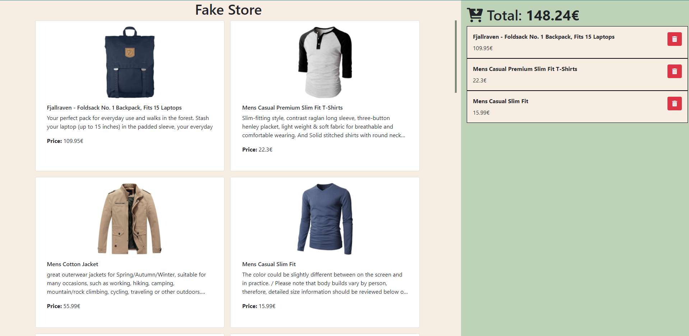

# GeeksHubs Reto-2 Showcase Dinámico

**Descripcion:**
**Reto2 de GeekHubs**, Curso Frontend Angular.
El objetivo es crear una tienda con un carrito de la compra.
La forma de interactuar con el carrito es arrastrar los elementos de la tienda hacia el.
Se deben crear los elementos dentro del carrito y deben poder borrarse.

## Tabla de contenido
- [➡️Empezamos](#Empezamos)
	- [📜El reto](#El-reto)
	- [🖼️ Screenshoot](#Screenshoot)
	- [🔗Links](#Links)
	- [⚙️¿Como hacerlo funcionar?](#¿Como-hacerlo-funcionar?)
	- [🎠Uso de la aplicación](#Uso-de-la-aplicación)
- [🎨Proceso de creación](#Proceso-de-creación)
	- [🧠¿Que he aprendido?](#¿Que-he-aprendido?)
	- [🔄Kaizen o Desarrollo Continuado](#Kaizen-o-Desarrollo-Continuado)
- [👨‍💻Autor](#Autor)

## Empezamos
### El reto
Los usuarios deben ser capaces de:

- Navegar entre los productos.
- Arrastrar los productos al carrito.
- Ver como el total se incrementa.
- Poder eliminar los elementos del carrito.
- Ver como el contador decrementa.

### Screenshoot


### Links
- Solution URL: [Code](https://github.com/nexus122/GeeksHubs---Reto-2---Showcase-Din-mico)
- Live Site URL: [Demo](https://nexus122.github.io/GeeksHubs---Reto-2---Showcase-Din-mico/)

### ¿Como hacerlo funcionar?
- Necesitas tener instalado git
- Utilizar el siguiente comando
```` console
git clone https://github.com/nexus122/GeeksHubs---Reto-2---Showcase-Dinamico.git
````

### Uso de la aplicación
- El usuario ve una pantalla llena de productos y una barra lateral derecha que es el carrito.
	- El usuario puede navegar con el scroll para ver todos los productos.
- El usuario puede arrastrar productos a la columna derecha.
	- El usuario puede navegar con el scroll en la columna derecha si hay demasiados elementos en el carrito.
- El usuario puede ver el total del carrito en lo alto de la columna derecha.
- El usuario puede borrar elementos del carrito, y el precio se vera afectado.

## Proceso de creación
### ¿Con que esta hecho?
- Semantic HTML5
- CSS3
- Bootstrap
- Javascript ES6

### ¿Que he aprendido?
- He aprendido a gestionar el estado general de una aplicacion.
- He aprendido a crear y gestionar elementos arrastrables.

### Kaizen o Desarrollo Continuado
- Para un futuro me gustaría mejorar el diseño de la aplicación.
- Me gustaria investigar más sobre el drag and drop y su uso en móvil ya que no me ha funcionado.
- Acumular en una unica tarjeta los productos repetidos, permitir añadir cantidad de productos desde las tarjetas.


## Autor
- Website - [Portfolio](https://jp-curriculum.super.site/)
- Linkedin - [Linkedin](https://www.linkedin.com/in/juan-pablo-romero-pereira-523996101/)
- Github - [@nexus122](https://github.com/nexus122)
